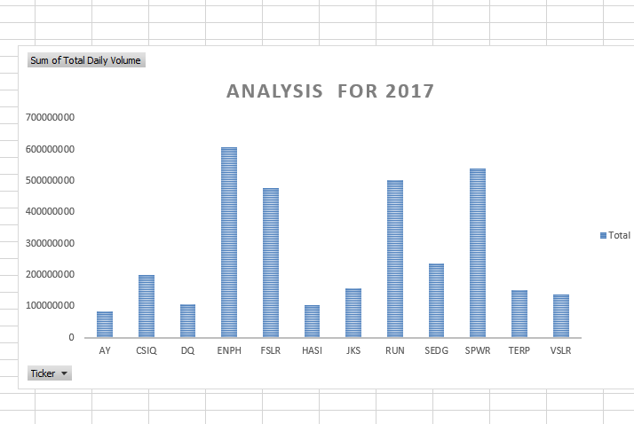

# All Stocks Analysis 

Overview of Project

-Purpose

Steve, our client, wants some qualitative stock market research  for his parents, and wants to expand the dataset to include the entire stock market over the last few years.

- Analysis and Challenges

There are 12 stocks in the market for which we are conducting an analsysis of volumes, returns and trends

- Results for 2017

Please refer to volumes and returns charts attached.

Ticker - ENPH had the highest volumes
Ticker - AY had the lowest volumes

- Results for 2018 

Ticker - ENPH also had the highest returns
Ticker - JKS had the lowest returns

- Analysis for 2018

Again like in 2017:

Ticker - ENPH had the highest volumes
Ticker - AY had the lowest volumes

The same is for returns as compared to 2017

Ticker - ENPH also had the highest returns
Ticker - JKS had the lowest returns

- Year over year comparison

2018 Volume  3,306,038,200.00 

2017 volume   3,166,639,100.00 

Trading volumes are up in 2018 as compared to 2017

2018 Total Returm -1.021 percent

2017 return  8.08 percent

Over ll conclusion

Returns are much lower in 2018 as compared to 2017. it is time to buys stocks

Challenges encountered: Nothing specifc to add.

Summary

Advantatges of refactoring
1) Makes analysis and comparison allencompassing and more flexible. You came compare data across various stocks across various years with a push of a buttton.

Disdavatages of refactoring
1) The file will become too huge and the macro might run slowley as as more and more years are added to the file and  lot more data needs to be analysed and compared 
2) Year over year analysis cannoct be run with this macro. It gives analysis of data for each year separately.

Advatages of original

1) Less complex code
2) Smaller data set nees to be analysed

1) 

Disadvantages of original
1) Less flexible. Will take more time to run the macro
2) the worksheed for the specifc years sheet needs to be activated every time you run the code.

- 

- Results

- What are two conclusions you can draw?

- What are some limitations of this dataset?

R

- What are some other possible tables and/or graphs that we could create?

